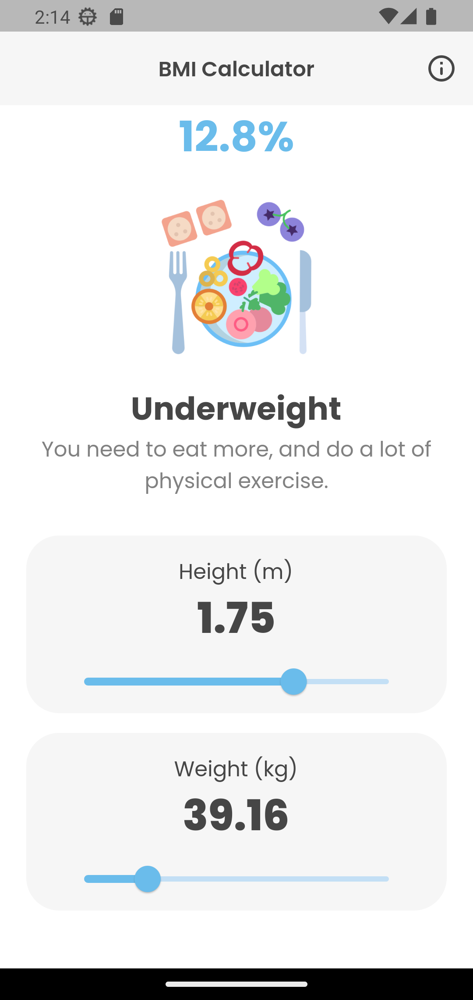

# Application to calculate body mass index

A mobile application, developed with Flutter, the function is to calculate the body mass index, according to the height and weight of the person, in addition to having a little more information on the subject.
## Development 
### Project structure
I think the most important part of the application is the `lib` and `assets` folder. Under `assets`, you will find the fonts and images used by the application. About the `lib` folder:

- **themes**: Files containing the application theme.

- **constant**: Texts I use in the `info_screen.dart` file.

- **screen**: The screen that the user can see.

- **widget**: They are like components, the `screen` folder depends on them.

- **route**: The routes of the mobile application.

- **helper**: Here is the logic of the application, like the formula.

- **class**: Here are the texts and images that will be displayed based on the result.

### My experience developing
I had a bit of difficulty with this project as I am very new to Flutter, so the communication between parent and child Widgets was confusing for me, I fixed it by passing functions as parameters. In other words, everything moves through the `home_screen.dart` file. Another problem was with the text themes, they gave me too many errors, but I managed to fix it, thanks to StackOverflow.

### Technologies used in the project

1. [Flutter](https://flutter.dev/)
2. [Dart](https://dart.dev/)

## Demo 

You can see the app running, just open the terminal and enter the following commands:
```
git clone https://github.com/YerikAH/calc-IMC
cd calc-IMC
flutter run
```
### Screenshots



## Author

- Harvey Yerik

    - [Twitter](https://twitter.com/yerikhar)
    - [GitHub](https://github.com/YerikAH)
    - [Send Me A Message](https://yerikah.github.io/send-me-a-message/dist/)
